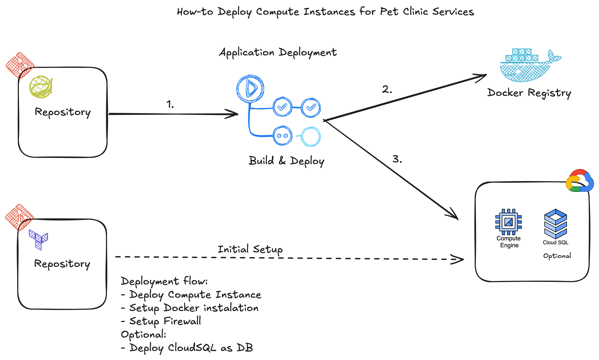

# Infrastructure for PetClinic

This directory contains the infrastructure code for the PetClinic application. The infrastructure code is responsible for provisioning and managing the cloud resources required to run the PetClinic application, such as virtual machines, databases, and firewall to allow the resources.

### Requirements

1. Terraform with minimal version e.g 1.1.7
2. GCP Accounts with Free tier

### Architecture Diagram
Here is the flow of the architecture diagram to deploy the infrastructure using Terraform.

