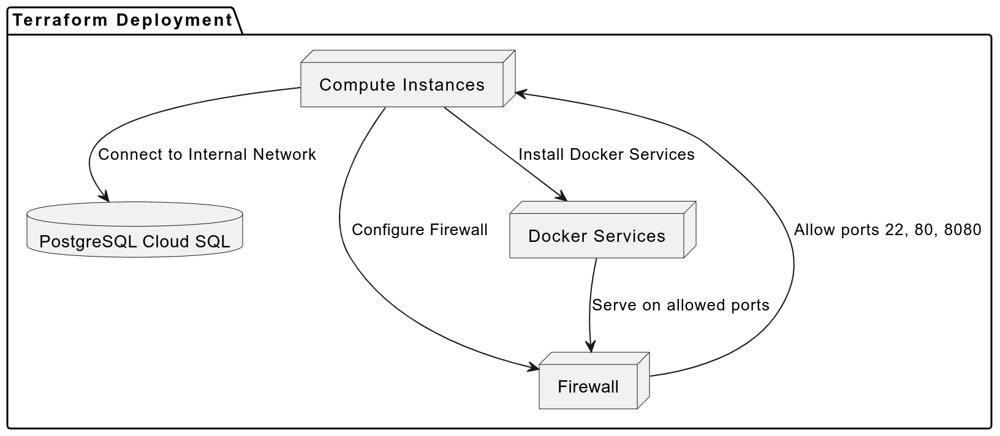

# Infrastructure for PetClinic

This directory contains the infrastructure code for the PetClinic application. The infrastructure code is responsible for provisioning and managing the cloud resources required to run the PetClinic application, such as virtual machines, databases, and firewall to allow the resources.

### Requirements

1. Terraform with minimal version e.g 1.1.7
2. GCP Accounts with Free tier

### Architecture Diagram
Also, here is the flow of the architecture diagram to deploy the infrastructure using Terraform.



### Steps to deploy

1. Try initialize the project

```sh
terraform init
```

2. And then make sure all the configuration met your expectation. Try to plan the Terraform.

```sh
terraform plan
```

3. Apply changes into the platform.

```sh
terraform apply
```